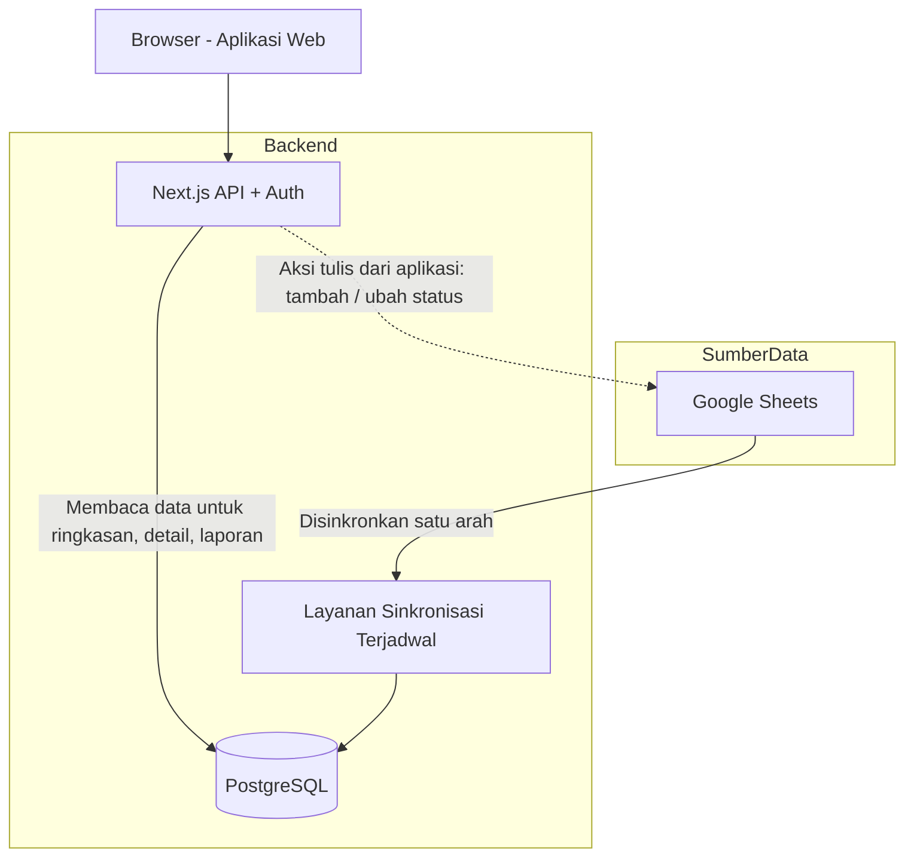
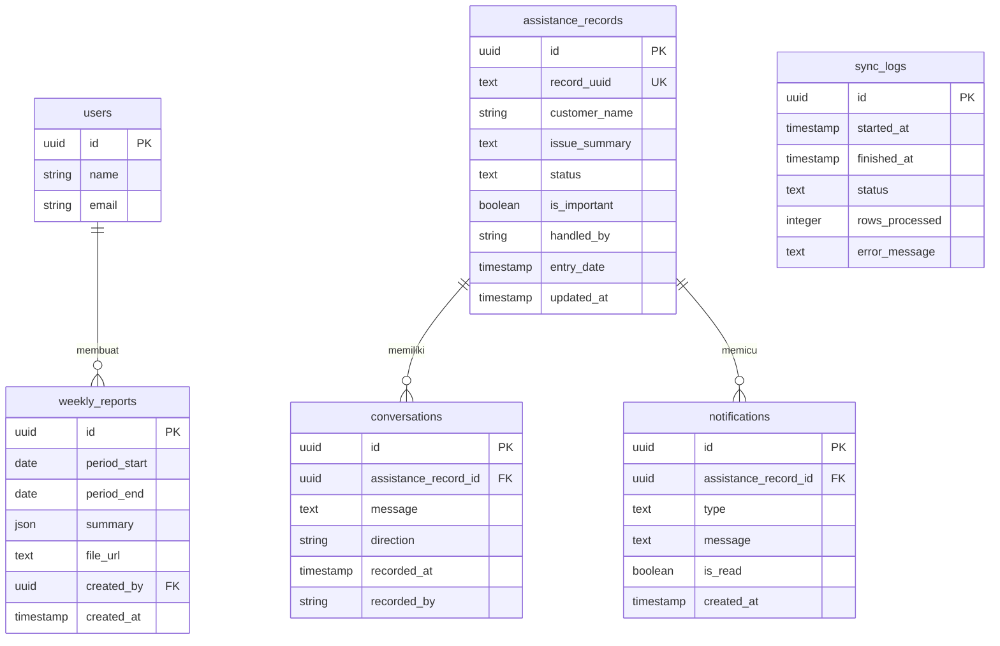

# PRD — Project Requirements Document

## 1. Overview

Saat ini data bantuan pelanggan dikumpulkan di Google Sheets. Data tersebut sulit dipantau secara cepat karena tersebar dalam banyak baris dan kolom, tidak ada ringkasan otomatis, riwayat percakapan sulit ditelusuri, dan laporan mingguan masih dibuat manual.

Aplikasi ini dibuat sebagai **satu tempat terpadu untuk melihat, memantau, dan mengelola seluruh data bantuan** yang bersumber dari Google Sheets. Aplikasi akan menampilkan ringkasan kondisi terbaru, riwayat percakapan, status penyelesaian, pencarian data lama, peringatan otomatis, serta laporan mingguan.

Keputusan penting yang menjadi dasar pengembangan: **Google Sheets tetap menjadi sumber input utama bagi tim**. Aplikasi tidak menggantikan Google Sheets sebagai tempat mencatat pertama. Sebaliknya, data dari Google Sheets disinkronkan satu arah ke database, lalu diolah dan ditampilkan di aplikasi agar lebih mudah dipantau dan dianalisis.

## 2. Requirements

**Kebutuhan utama proyek:**

- Aplikasi digunakan oleh tim internal / petugas customer support yang sudah memiliki akun.
- Google Sheets adalah sumber kebenaran utama untuk data bantuan.
- Sinkronisasi berjalan **satu arah dari Google Sheets ke database**, bukan dua arah.
- Jika ada perubahan data melalui aplikasi, perubahan tersebut ditulis ke Google Sheets terlebih dahulu, lalu sinkronisasi otomatis memperbarui database.
- Setiap baris bantuan di Google Sheets harus memiliki kunci unik `RECORD_UUID` agar sinkronisasi stabil dan tidak mudah salah ketika baris dihapus atau diurutkan ulang.
- Sheet master perlu dibersihkan dari artefak export Google Sheets, misalnya formula sisa `DUMMYFUNCTION` dan dropdown yang rusak (`#REF!`), sebelum menjadi acuan final.
- Aplikasi harus mampu menampilkan data yang selalu terbaru melalui pembaruan otomatis dan tombol muat ulang manual.
- Data yang ditampilkan mencakup ringkasan jumlah bantuan, status, riwayat percakapan, data lama, peringatan, dan laporan mingguan.

## 3. Core Features

### Fase 1 — Ringkasan Bantuan

- **Kartu Angka Penting**  
  Menampilkan total bantuan, jumlah bantuan yang belum selesai, dan jumlah bantuan yang butuh perhatian.

- **Grafik Perkembangan**  
  Menampilkan grafik tren banyaknya bantuan per hari atau per minggu.

- **Daftar Bantuan Terbaru**  
  Menampilkan daftar bantuan terbaru dan memungkinkan pengguna membuka detail bantuan langsung dari halaman ringkasan.

### Fase 2 — Riwayat Percakapan & Status Bantuan

- **Riwayat Percakapan**  
  Mencatat, melihat, dan memperbarui setiap percakapan bantuan dalam satu daftar yang rapi.

  - **Tambah Percakapan Baru** — Membuat catatan bantuan baru lengkap dengan nama dan masalahnya.
  - **Lihat Detail Bantuan** — Membuka satu bantuan untuk membaca seluruh riwayat percakapan dari awal sampai akhir.
  - **Lanjutkan Catatan** — Menambahkan perkembangan atau balasan terbaru pada percakapan yang masih berjalan.

- **Status Bantuan**  
  Menandai bantuan penting dan memperbarui status penyelesaian agar mudah dipilah.

  - **Tandai Penting** — Menandai bantuan yang butuh perhatian khusus hanya dengan satu sentuhan.
  - **Ubah Status Penyelesaian** — Memperbarui status bantuan, misalnya masih diproses, menunggu, atau selesai.
  - **Lihat Menurut Status** — Menampilkan daftar bantuan berdasarkan statusnya agar mudah dicek.

### Fase 3 — Pencarian & Peringatan

- **Cari Data Lama**  
  Menemukan kembali percakapan atau data bantuan dari masa lalu dengan cepat.

  - **Cari Kata Kunci** — Mencari berdasarkan nama, topik, atau isi percakapan.
  - **Filter Rentang Tanggal** — Mempersempit pencarian ke periode tertentu.
  - **Filter Berdasarkan Penangan** — Menyaring data lama berdasarkan petugas atau penanggung jawab bantuan.

- **Peringatan Masalah**  
  Mengingatkan secara otomatis bila ada bantuan yang butuh perhatian atau sudah lama belum ditindaklanjuti.

  - **Tanda Bantuan Penting** — Menampilkan notifikasi saat ada bantuan yang baru ditandai penting.
  - **Pengingat Belum Ditindaklanjuti** — Memberi peringatan jika ada bantuan yang belum dibalas terlalu lama.
  - **Daftar Pemberitahuan** — Mengumpulkan semua peringatan yang masuk dan menandainya sudah dibaca.

### Fase 4 — Laporan & Kesegaran Data

- **Laporan Mingguan**  
  Menyusun rekap otomatis semua bantuan setiap minggu untuk dipantau bersama tim.

  - **Buat Laporan Otomatis** — Menghasilkan ringkasan bantuan selama satu minggu dari data yang tersedia.
  - **Pratinjau Sebelum Kirim** — Melihat isi laporan terlebih dahulu sebelum dibagikan atau diunduh.
  - **Unduh atau Kirim** — Mengunduh laporan dalam bentuk file atau membagikannya ke rekan.

- **Data Selalu Terbaru**  
  Menjaga semua angka dan riwayat tetap sama dengan catatan terakhir di Google Sheets.

  - **Tombol Muat Terbaru** — Mengambil data terbaru dari Google Sheets kapan saja dibutuhkan.
  - **Pembaruan Otomatis** — Memperbarui data secara rutin tanpa tindakan pengguna.
  - **Info Terakhir Diperbarui** — Menampilkan tanggal dan jam pengambilan data terakhir agar pengguna tahu datanya masih baru.

## 4. User Flow

Berikut alur utama penggunaan aplikasi oleh petugas atau admin:

1. **Masuk dan melihat kondisi terbaru**  
   Petugas membuka aplikasi dan masuk dengan akunnya. Aplikasi menampilkan halaman Ringkasan Bantuan berisi kartu angka penting, grafik perkembangan, dan daftar bantuan terbaru.

2. **Memeriksa detail bantuan**  
   Dari daftar bantuan terbaru, petugas memilih salah satu bantuan untuk melihat detail. Halaman detail menampilkan seluruh riwayat percakapan, status, petugas penangan, dan tanggal-tanggal penting.

3. **Mencatat atau melanjutkan percakapan**  
   Jika ada bantuan baru atau perkembangan terbaru, petugas dapat menambah catatan baru dari aplikasi atau langsung dari Google Sheets seperti biasa. Setelah disinkronkan, catatan tersebut muncul di riwayat percakapan.

4. **Memperbarui status**  
   Petugas dapat menandai bantuan sebagai penting, atau mengubah status menjadi masih diproses, menunggu, atau selesai. Perubahan ini tercatat dan langsung terlihat pada ringkasan serta daftar.

5. **Mencari data lama**  
   Saat membutuhkan data dari masa lalu, petugas membuka halaman pencarian, mengetik kata kunci, memilih rentang tanggal, dan menyaring berdasarkan penangan.

6. **Mengecek peringatan**  
   Petugas membuka daftar pemberitahuan untuk melihat bantuan penting yang belum ditangani atau bantuan yang sudah lama tidak dibalas. Setelah dicek, peringatan dapat ditandai sudah dibaca.

7. **Menyusun dan mengirim laporan mingguan**  
   Sistem membuat laporan mingguan secara otomatis. Petugas melihat pratinjau, lalu mengunduh atau mengirim laporan ke rekan.

## 5. Architecture

Aplikasi menggunakan arsitektur dengan **Google Sheets sebagai sumber data utama** dan **PostgreSQL sebagai tempat data diolah serta ditampilkan**.

Alur utamanya:

- Google Sheets menjadi tempat tim mencatat bantuan.
- Layanan sinkronisasi berjalan secara terjadwal untuk membaca data dari Google Sheets lalu menyimpannya ke PostgreSQL.
- Aplikasi web membaca data dari PostgreSQL untuk ditampilkan ke pengguna.
- Jika petugas menambah atau mengubah data melalui aplikasi, aplikasi menulis ke Google Sheets terlebih dahulu. Setelah itu, sinkronisasi biasa yang memperbarui PostgreSQL. Dengan begitu, PostgreSQL tidak pernah menulis balik ke Google Sheets.

Penjelasan tambahan:

- Sinkronisasi menggunakan `RECORD_UUID` sebagai kunci tetap, sehingga perubahan di Google Sheets tidak membingungkan sistem.
- Proses sinkronisasi hanya membaca dan memetakan data, tidak menghitung ulang formula dari Google Sheets.
- Notifikasi dan laporan mingguan dibuat oleh aplikasi dari data yang ada di PostgreSQL.
- Tombol **Muat Terbaru** memicu sinkronisasi manual, sedangkan **Pembaruan Otomatis** berjalan sesuai jadwal.

## 6. Database Schema

Database menyimpan data bantuan yang sudah disinkronkan dari Google Sheets, beserta data pelengkap seperti percakapan, notifikasi, laporan, dan riwayat sinkronisasi.

### Tabel utama:

**`users`**
- `id` — UUID, kunci utama.
- `name` — text, nama petugas.
- `email` — text, alamat email untuk login.
- Tabel ini dikelola oleh Better Auth beserta tabel pendukung sesi dan akun.

**`assistance_records`**
- `id` — UUID, kunci utama internal.
- `record_uuid` — text unik, kunci stabil dari Google Sheets.
- `customer_name` — text, nama pengguna bantuan.
- `issue_summary` — text, ringkasan masalah atau topik bantuan.
- `category` — text opsional, kategori bantuan.
- `status` — text, status penyelesaian: baru, diproses, menunggu, selesai.
- `is_important` — boolean, penanda bantuan penting.
- `handled_by` — text, nama petugas atau penanggung jawab.
- `source_sheet` — text, nama sheet asal data.
- `entry_date` — timestamp, tanggal bantuan masuk.
- `updated_at` — timestamp, waktu terakhir diperbarui.

**`conversations`**
- `id` — UUID, kunci utama.
- `assistance_record_id` — UUID, foreign key ke `assistance_records`.
- `message` — text, isi percakapan atau catatan perkembangan.
- `direction` — text, misalnya masuk, keluar, atau catatan internal.
- `recorded_at` — timestamp, waktu percakapan atau catatan dibuat.
- `recorded_by` — text, nama petugas yang mencatat.

**`notifications`**
- `id` — UUID, kunci utama.
- `assistance_record_id` — UUID, foreign key ke `assistance_records`.
- `type` — text, jenis peringatan: bantuan penting, belum ditindaklanjuti.
- `message` — text, isi peringatan.
- `is_read` — boolean, penanda sudah dibaca atau belum.
- `created_at` — timestamp, waktu peringatan muncul.

**`sync_logs`**
- `id` — UUID, kunci utama.
- `started_at` — timestamp, waktu sinkronisasi dimulai.
- `finished_at` — timestamp, waktu sinkronisasi selesai.
- `status` — text, hasil sinkronisasi: berhasil, gagal, sebagian.
- `rows_processed` — integer, jumlah baris yang diproses.
- `error_message` — text, pesan kesalahan bila ada.

**`weekly_reports`**
- `id` — UUID, kunci utama.
- `period_start` — date, awal periode laporan.
- `period_end` — date, akhir periode laporan.
- `summary` — json, ringkasan data laporan.
- `file_url` — text, lokasi file laporan yang bisa diunduh.
- `created_by` — UUID, foreign key ke `users`.
- `created_at` — timestamp, waktu laporan dibuat.

## 7. Tech Stack

- **Frontend:** Next.js, Tailwind CSS, dan shadcn/ui untuk tampilan antarmuka yang cepat dan konsisten.
- **Backend / API:** Next.js Route Handlers atau Server Actions untuk logika aplikasi dan autentikasi.
- **Database:** PostgreSQL — dipilih karena lebih cocok untuk data hasil sinkronisasi, pencarian, dan laporan yang terus bertambah.
- **ORM:** Drizzle ORM untuk mengelola query dan skema database.
- **Autentikasi:** Better Auth untuk login petugas dan admin.
- **Sinkronisasi Google Sheets:** Google Sheets API untuk membaca dan menulis data ke sheet.
- **Penjadwalan:** Platform cron / scheduler bawaan deployment untuk menjalankan sinkronisasi otomatis dan pembuatan laporan.
- **Laporan:** Library pembuatan file PDF/Excel untuk fitur unduh laporan mingguan.
- **Deployment:** Vercel atau platform sejenis, dengan PostgreSQL terkelola.